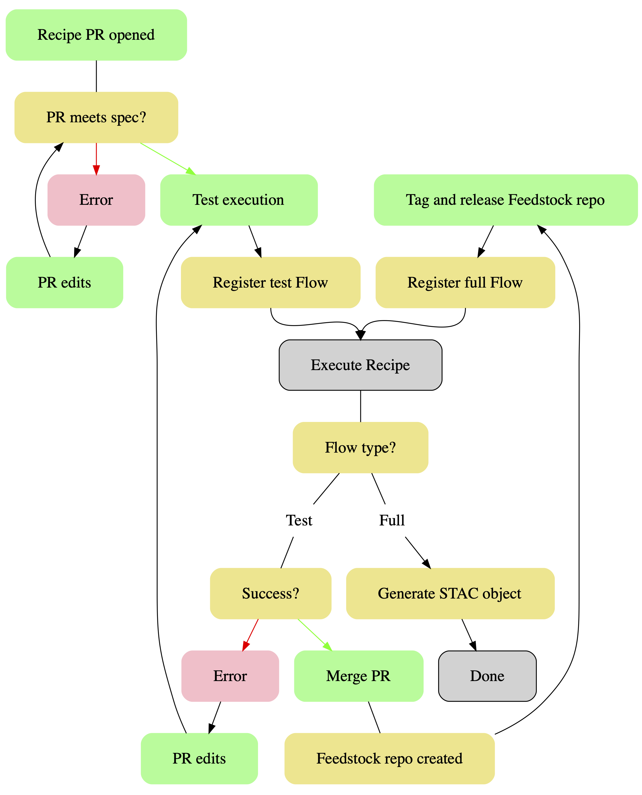
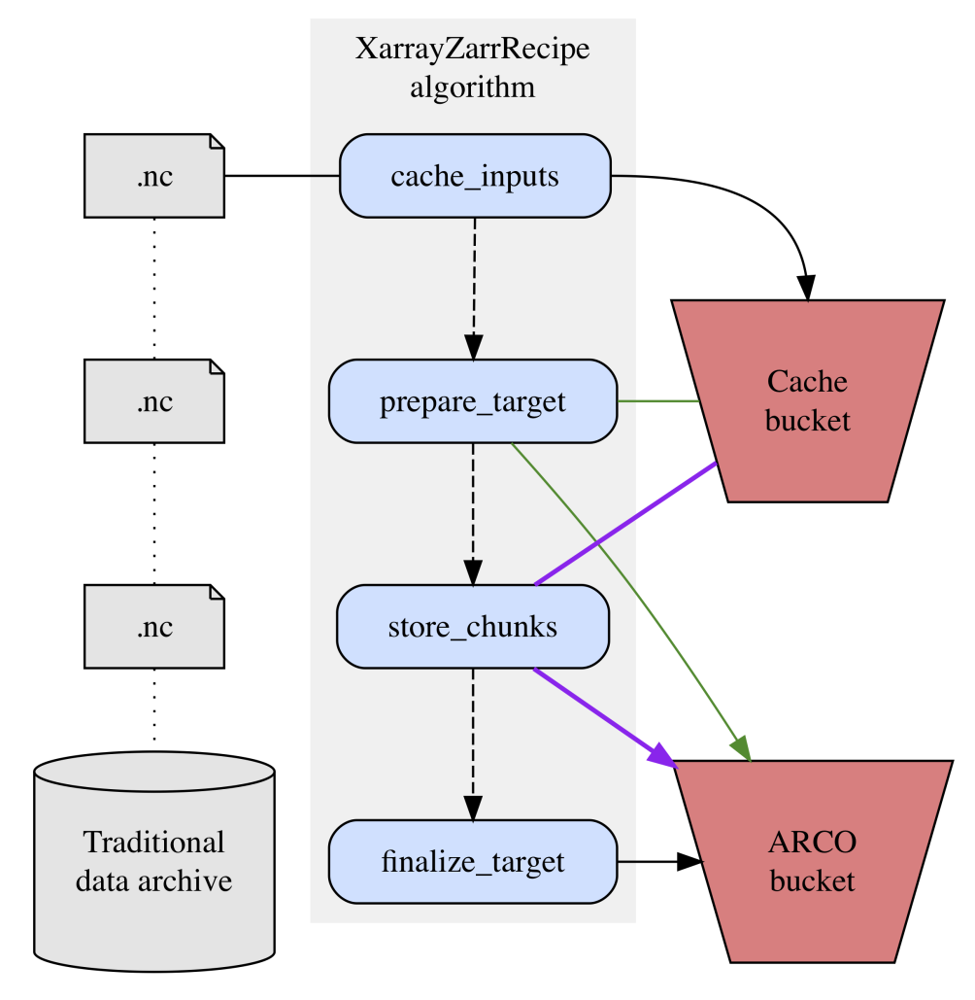

# flow-charts
Flow charts describing various aspects of Pangeo Forge architecture.

Charts are developed with http://graphviz.org/. Two options for interactively developing graphviz graphs:
1. https://hackmd.io/features?both#Graphviz
2. https://marketplace.visualstudio.com/items?itemName=joaompinto.vscode-graphviz

> Note: These diagrams are works-in-progress and are not currently regarded as authoritative documentation. The callstack annotations in particular are not complete and contain known errors.

| CI Flow - Simple | CI Flow - Detailed | Detail plus callstack annotations |
| --------------- | --------------- | -------------------------- |
|  |  |  |

| Architecture: high level view |
| ----------------------------- |
|  

| XarrayZarrRecipe algorithm details |
| ----------------------------- |
|  